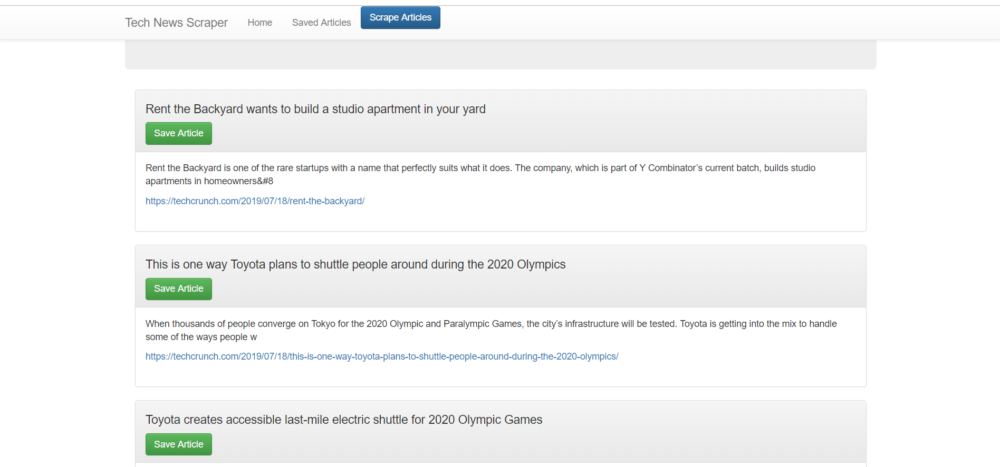
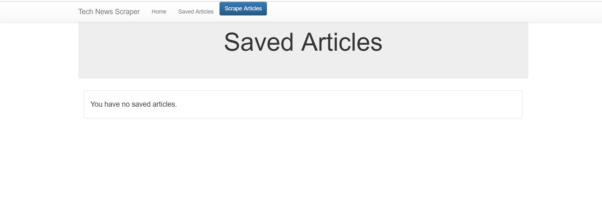

# fitToScrape

<!-- Heroku Link -->

https://blooming-springs-81725.herokuapp.com/

*May need too do `/scrape` to get data. Having issues getting the buttons to work. 
Since no buttons are currently working, we are unable to save an article, leave a note, or delete a note. 

Using techcrunch.com to scrape data. 

<!-- Home page -->

<!-- Saved Page -->
